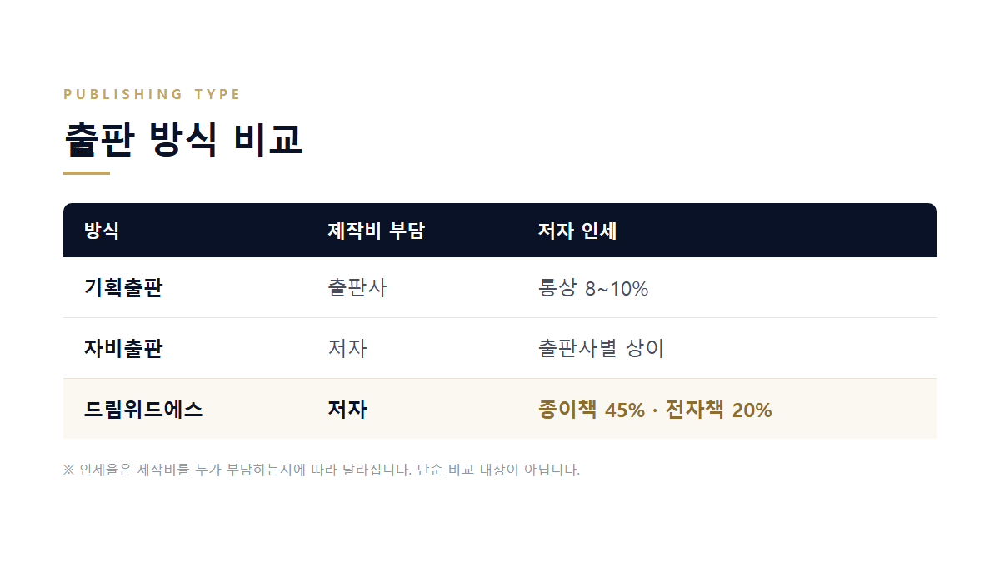
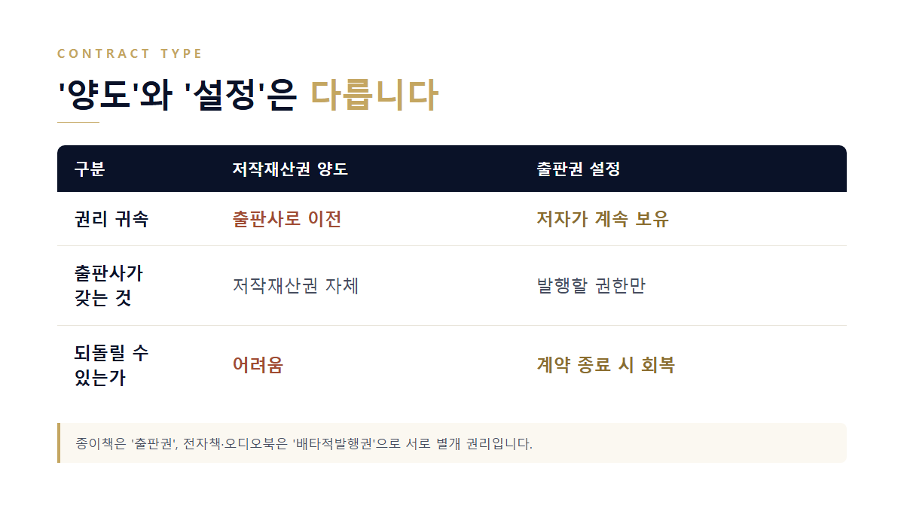
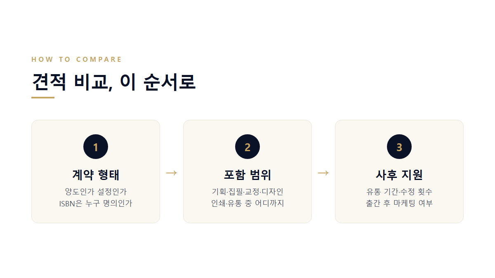
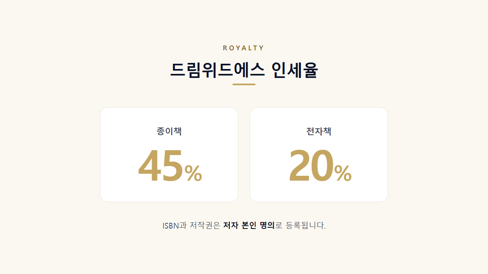
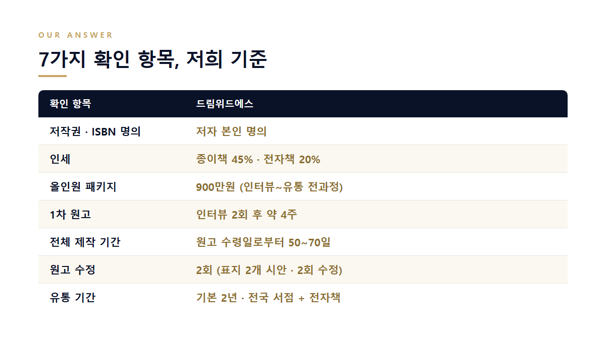

## 견적을 세 군데 받았는데, 뭘 기준으로 골라야 하나요?

첫 책을 준비하시는 분들이 가장 많이 하시는 질문입니다.

출판사 세 곳에서 견적을 받았는데 금액이 200만원부터 2,000만원까지 벌어집니다. 그런데 견적서를 아무리 들여다봐도 무엇이 다른지 알기 어렵습니다. 항목명은 비슷한데 금액만 다르기 때문입니다.

여기에는 이유가 있습니다. **같은 "900만원"이라도 그 안에 포함된 범위가 완전히 다릅니다.** 어떤 곳은 인쇄만, 어떤 곳은 기획부터 유통·마케팅까지 포함한 금액입니다.

그래서 금액을 비교하기 전에 확인해야 할 것이 따로 있습니다. 이 글에서는 그 기준을 정리해 드리겠습니다.

## 먼저, 출판 방식부터 다릅니다

출판사를 고르기 전에 **내가 어떤 방식으로 낼 것인지**부터 정해야 합니다. 방식이 다르면 비용을 누가 부담하는지, 인세를 얼마나 받는지가 전부 달라집니다.

여기서 흔한 오해가 하나 있습니다. "자비출판은 돈을 내고 내는 거라 급이 낮다"고 생각하시는 경우가 많습니다. 하지만 ISBN이 정식 발급되고 전국 서점에 유통되면, 서지 정보상으로는 기획출판과 차이가 없습니다.

다만 자비출판은 출판사가 제작비 리스크를 지지 않습니다. 그래서 **출판사가 얼마나 성실하게 만드는지가 전적으로 계약 조건에 달려 있습니다.** 계약을 먼저 봐야 하는 이유입니다.

## 정부가 만든 '출판 표준계약서'를 아시나요?

의외로 모르시는 분이 많습니다.

**문화체육관광부는 2014년 6월 출판 분야 표준계약서 7종을 제정해 공개하고 있습니다.** 출판권 설정계약서, 전자출판 배타적발행권 설정계약서, 저작재산권 양도계약서, 오디오북 배타적발행권 설정계약서 등입니다.

제정 취지가 중요합니다. **매절계약 관행 때문에 권리 보호에 취약했던 신인·무명작가를 보호하기 위해서**였습니다. 즉 처음 책을 내는 사람이 불리한 계약을 맺지 않도록 정부가 기준표를 만들어 둔 것입니다.

저희 같은 자비출판 제작·유통 계약이 이 표준계약서와 형태가 완전히 같지는 않습니다. 하지만 **어떤 출판사와 상담하시든, 권리 관계를 확인하는 기준으로는 그대로 쓰실 수 있습니다.**

## '양도'와 '설정'은 완전히 다릅니다

표준계약서 7종을 보면 「저작재산권 양도계약서」와 「출판권 설정계약서」가 **각각 따로** 있습니다. 이름이 비슷해 보이지만 결과는 전혀 다릅니다.

여기에 한 가지가 더 있습니다. **종이책에 미치는 권리는 '출판권', 전자책과 오디오북에 미치는 권리는 '배타적발행권'으로 서로 별개입니다.**

이걸 모르면 종이책만 생각하고 계약했다가, 나중에 전자책을 내려고 할 때 이미 권리가 묶여 있는 상황이 생길 수 있습니다. 계약서에 전자책 항목이 어떻게 되어 있는지 따로 확인하셔야 하는 이유입니다.

## 출판사에 물어봐야 할 7가지

어느 출판사와 상담하시든 아래 7가지를 그대로 물어보시면 됩니다. 답변을 나란히 놓고 비교하면 견적 금액의 차이가 어디서 오는지 보입니다.

**1. 저작권을 '양도'하나요, '설정'하나요?**
가장 먼저 확인하셔야 합니다. 이렇게 물어보세요 — "계약서상 저작재산권이 이전되나요, 아니면 발행 권한만 설정되나요?"

**2. 종이책과 전자책 권리가 분리되어 있나요?**
이렇게 물어보세요 — "전자책 권리는 별도 계약인가요? 나중에 다른 곳에서 전자책을 낼 수 있나요?"

**3. ISBN은 누구 명의로 등록되나요?**
ISBN은 국립중앙도서관 서지정보유통지원시스템에 등록됩니다. 저자 본인 명의가 아니라면, 이후 2쇄나 해외판을 진행할 때마다 출판사 동의가 필요해집니다.

**4. 이 견적에 정확히 무엇이 포함되나요?**
기획·집필·교정교열·표지 디자인·내지 편집·인쇄·ISBN·유통·마케팅 중 어디까지인지 항목별로 받아보세요. 별도 비용이 발생하는 항목도 함께 물어보시면 좋습니다.

**5. 인세는 몇 %이고, 판매 부수를 제가 직접 확인할 수 있나요?**
비율만큼 중요한 것이 확인 방법입니다. 판매 현황을 저자가 직접 조회할 수 없는 구조라면 정산을 검증하기 어렵습니다.

**6. 원고 수정은 몇 회까지 가능한가요?**
"수정 무제한"은 현실적으로 지켜지기 어렵습니다. 오히려 **몇 회까지, 어느 단계에서 가능한지가 계약서에 명확히 적힌 곳**이 신뢰할 만합니다.

**7. 유통 기간은 몇 년이고, 이후엔 어떻게 되나요?**
유통 기간이 끝나면 책이 서점에서 내려갑니다. 연장 조건과 재고 처리 방식까지 함께 확인하세요.

## 같은 900만원인데 결과가 갈리는 이유

실제로 견적을 비교하다 보면 이런 상황이 자주 생깁니다.

한 전문직 저자분은 세 곳에서 견적을 받았는데 금액 차이가 커서 판단이 어려웠습니다. 위 4번(포함 범위)과 7번(사후 지원) 기준으로 나란히 놓고 보니 차이가 분명해졌습니다. 저가 견적은 인쇄 중심이었고, 고가 견적은 마케팅과 강연 연결까지 포함이었습니다. 출간 목적이 브랜딩이었기 때문에 후자를 선택하셨습니다.

같은 금액이라도 **무엇을 위해 책을 내는지에 따라 정답이 달라집니다.** 그래서 견적을 받기 전에 목적을 먼저 정하시는 편이 좋습니다.

## 드림위드에스는 이 7가지에 이렇게 답합니다

위 기준은 저희를 고르시라고 만든 것이 아닙니다. 어느 출판사와 상담하시든 쓰실 수 있도록 정리한 것입니다. 참고를 위해 저희 기준도 같은 형식으로 공개합니다.

- **저작권·ISBN 명의** — 전부 저자 본인 명의입니다.
- **인세** — 종이책 45%, 전자책 20%입니다.
- **견적 포함 범위** — 올인원 패키지 900만원에 인터뷰부터 집필·디자인·인쇄·유통까지 포함됩니다.
- **제작 기간** — 인터뷰 2회 후 약 4주에 1차 원고를 받으실 수 있습니다. 전체 제작은 원고 수령일로부터 50~70일입니다.
- **원고 수정** — 1차 원고 이후 2회입니다. 표지는 2개 시안에 2회 수정입니다.
- **유통** — 기본 2년이며 전국 서점과 전자책 플랫폼(밀리의서재·교보·예스24·리디)에 유통됩니다.

누적 890권 이상을 출간하며 10년 넘게 유지해 온 기준입니다.

## 이런 경우엔 저희가 아닐 수 있습니다

솔직하게 두 가지를 말씀드립니다.

**첫째, 이미 원고 완성도가 높고 독자층이 확보되어 있다면 기획출판을 먼저 시도해 보시는 편이 낫습니다.** 출판사가 제작비를 부담하는 구조이니 비용 면에서 유리합니다.

**둘째, 저희 인세 45%는 자비출판 기준입니다.** 제작비를 출판사가 부담하는 기획출판은 통상 8~10% 수준인데, 이 둘은 비용을 누가 대는지가 달라서 단순 비교할 수 있는 숫자가 아닙니다. 45%라는 숫자만 보고 판단하지 않으셨으면 합니다.

## 더 구체적인 상황이라면

- 자비출판 비용·인세·유통을 더 자세히 비교하고 싶으신 경우
- 원고 없이 인터뷰만으로 책을 만드는 과정이 궁금하신 경우
- CEO·의사·변호사 등 전문직 퍼스널 브랜딩 목적인 경우
- 출간 이후 마케팅과 강연 연결까지 고려하시는 경우

## 어떤 방식이 맞는지부터 확인해 보세요

지금 상황과 출간 목적을 알려주시면, 어떤 출판 방식이 맞는지부터 함께 정리해 드립니다. 견적서 항목별 정리본도 보내 드립니다.

원고가 아직 없어도 괜찮습니다. 지금 필요한 것은 완벽한 원고가 아니라 시작할 수 있는 구조입니다.

## 자주 묻는 질문

**Q. 원고가 하나도 없는데 책을 낼 수 있나요?**
A. 가능합니다. 인터뷰 2회로 책의 뼈대를 만들고, 그 내용을 바탕으로 전문 작가가 원고를 구성합니다. 인터뷰 완료 후 약 4주에 1차 원고를 받아보실 수 있습니다.

**Q. 자비출판으로 낸 책도 서점에서 판매되나요?**
A. 네. ISBN이 정식 등록되고 전국 온·오프라인 서점에 유통됩니다. 전자책은 밀리의서재·교보·예스24·리디에 등록됩니다.

**Q. 저작권이 출판사로 넘어가는 건 아닌가요?**
A. 저희는 ISBN과 저작권 모두 저자 본인 명의로 등록합니다. 다만 출판사마다 계약 형태가 다르므로, 상담하시는 곳에 "저작재산권이 이전되는지, 발행 권한만 설정되는지"를 꼭 확인해 보시기 바랍니다.

**Q. 유통 기간 2년이 지나면 책은 어떻게 되나요?**
A. 기본 유통 기간은 2년이며 이후 연장이 가능합니다. 계약 시 연장 조건과 재고 처리 방식을 함께 안내해 드립니다.
